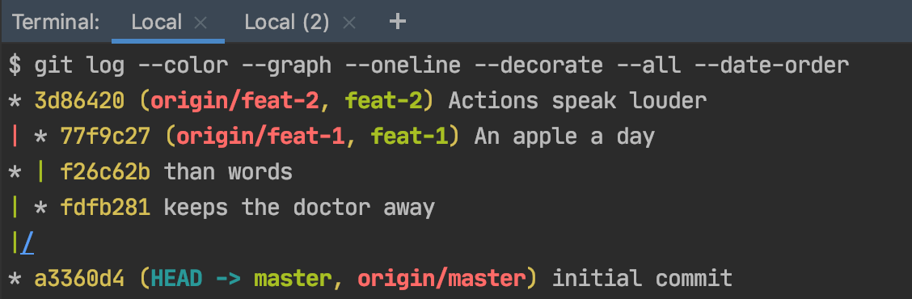
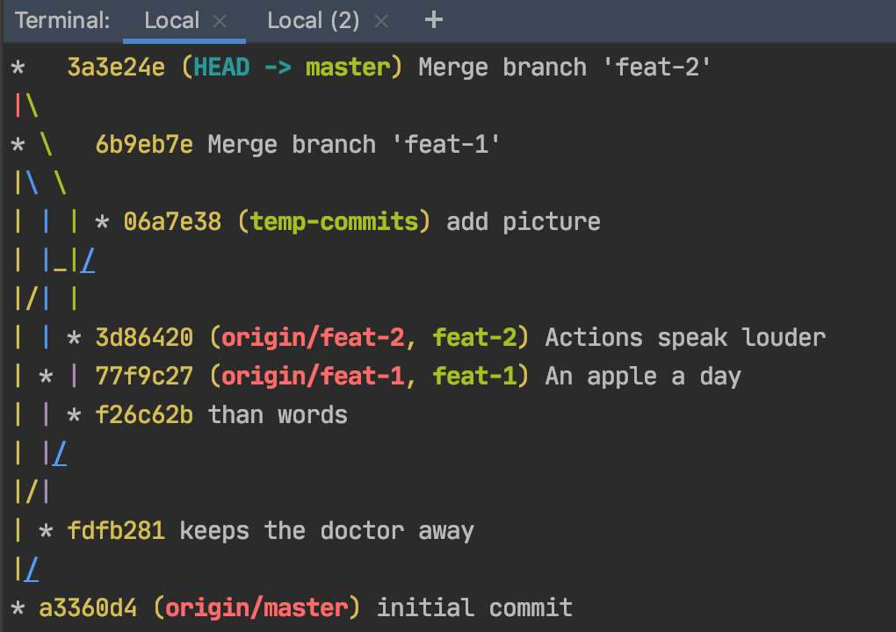
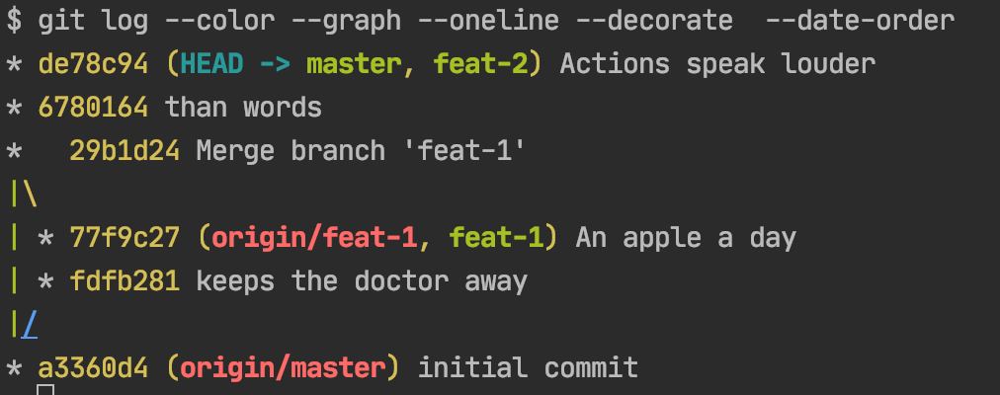
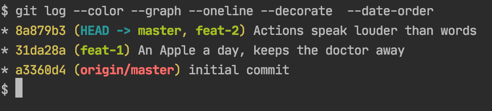

**git rebase** - cleaner git history
---

## Setup
Run the following file [git-rebase-create-base-branch-setup.sh](git-rebase-create-base-branch-setup.sh):
```
cd git-rebase
sh git-rebase-create-base-setup.ch
```
to create the base setup:

 
> You can see there is an intertwined commit order through the different branches. This is displayed if you
> execute the following command `git log --color --graph --oneline --decorate --all --date-order`

 
## Merge branches no fast forwarding (`--no-ff`) to see the result 
```
git switch master
git merge --no-ff feat-1
git merge --no-ff feat-2
git push
```


 
 > A total mess, especially if you are looking through history with a tool like Bitbucket

## Better - Rebase branch **feat-2** for a flatter git history
### Reset previous merge commits
```
git reset --hard HEAD^^
git push --force-with-lease
 ```

### merge “feat-1” branch 
```
git checkout master
git merge --no-ff feat-1
git push
```
 
### rebase “feat-2” on master 
```
git checkout feat-2
git rebase master
git push --force-with-lease
```
 
### merge “feat-2” without “--no-ff” to show the difference
```
git checkout  master
git merge feat-2
git push
```
 
> Resource - [What is the difference between `git merge` and `git merge --no-ff`?](https://stackoverflow.com/questions/9069061/what-is-the-difference-between-git-merge-and-git-merge-no-ff)
 

 
## The cleanest history - rebase and fixup
### Reset to initial commit
git log --oneline --grep="initial commit" --pretty=format:"%h" 
 
### git rebase feat-1
```
git rebase -i HASH_master_HEAD
```

Use different options to play with the three commits (fixup and rewrite two in one and maybe keep the fix if important)
* p - pick
* f - fixup
* r - rewrite
 
## merge back into master
```
git checkout master
git merge  feat-1 # --ff
git push
```

 
# rebase feat-2 and merge into master
```
git checkout feat-2
git rebase  master
```

 
# fixup and rebase feat-2
```
git checkout feat-2
git log --oneline
git rebase  -i HASH_master_HEAD # commit before feat-2 commits
git push --force-with-lease
git push #mention NO --no-ff
```

 
## merge into master
```
git checkout master
git merge feat-2
git push
```

A **clean history** should look now something like the following:

